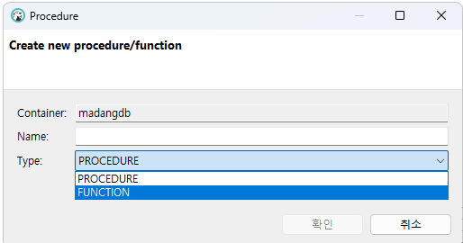
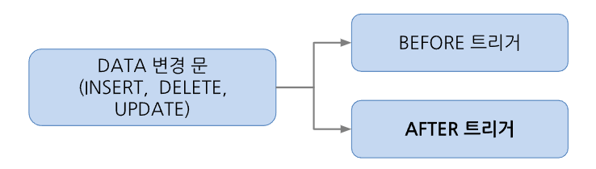
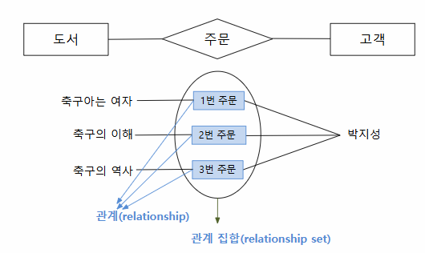
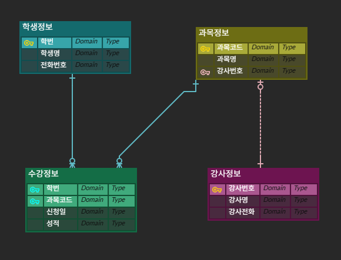
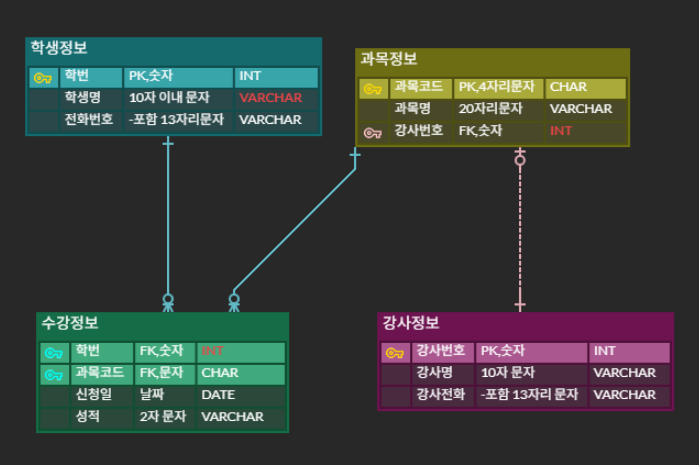
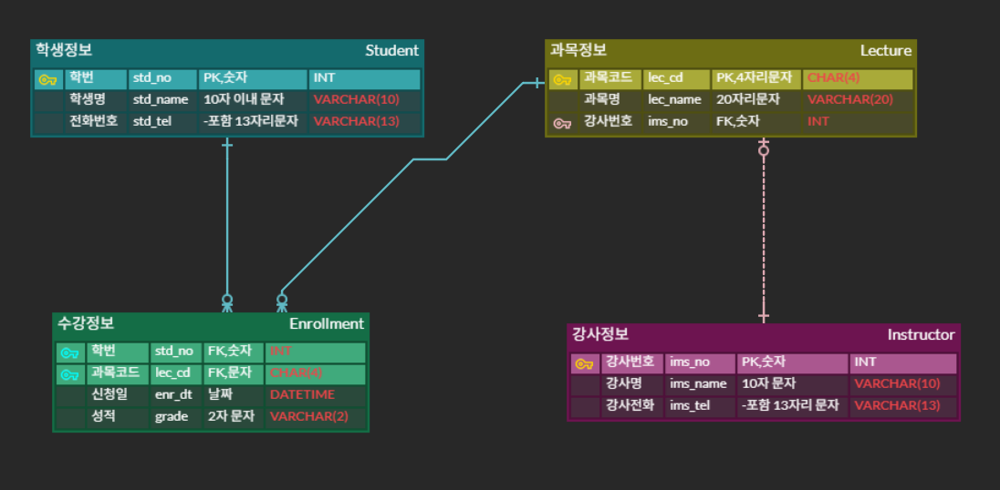
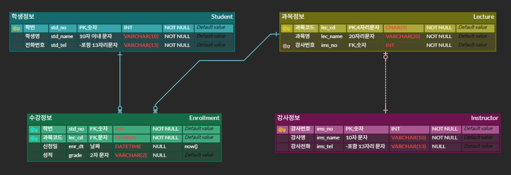
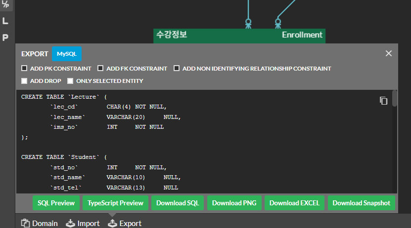
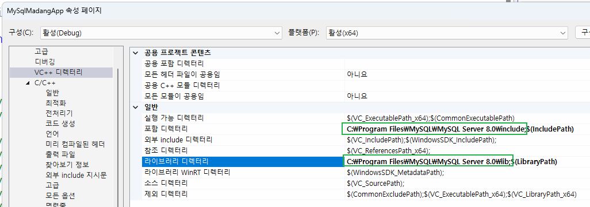

# iot-database-2026
2026년 iot개발자 데이터베이스 리포지토리

## 1일차

### 데이터/정보/지식
- `데이터` : 단순한 수치나 값
- `정보` : 데이터의 의미를 부여한 것
- 지식 : 정보를 통한 사물이나 현상에 대한 이해

### 데이터베이스
- 조직에 필요한 정보를 위해서 논리적으로 연관된 데이터를 구조적으로 통합,저장해 놓은 것
- `도메인` - 자기 업무에 관련된 지식
- 기업/기관은 자기 도메인 정보만 저장
- 보통 CS(Client - Server) 프로그램이라고 명칭, DB쪽이 서버, 프로그램쪽이 클라이언트

#### 데이터베이스 개념, 특징

- 통합 데이터 - `데이터 중복 최소화`, 중복으로 인한 데이터 `불일치 현상 제거`
- 저장 데이터 - 문서가 아닌 `컴퓨터 저장장치에 저장`, 반영구적 저장
- 운영 데이터 - 저장된 상태에서 `업무를 위해` 검색,수정 등 사용 가능
- 공용 데이터 - 여러 사람이 업무를 위해 `공동으로 사용`

#### 특징
- 실시간 접근성 - 수 초내 결과가 리턴
- 계속적 변화 - 추가,수정,삭제,조회 가능
- 동시 공유 - 여러 사용자가 동시에 공유, 같은 데이터를 사용하더라도 최대한 문제가 없게 처리
- 내용에 따른 참조 - 물리적인 저장 데이터가 아닌 데이터값을 참조

#### DBMS
- 데이터베이스를 관리하는 시스템 DataBase Managemnt System의 약자
- DBMS를 데이터베이스,DB로 통칭

#### DBMS 장점
- 데이터 중복최소화,데이터 일관성,데이터 독립성,관리기능(백업,복구,`동시성제어`,계정,보안)개발 생산성,`데이터 무결성 유지`,데이터 표준 준수...

### 데이터베이스 설치

#### 로컬 설치
1. https://www.mysql.com/ 사이트 > 다운로드 메뉴
2. MySQL Community Edition 아래 링크 클릭
3. MySQL Installer for Windows 링크 클릭
4. Windows (x86, 32-bit), MSI Installer 500M 이상 파일 다운로드
5. 회원가입이나 로그인 없이 클릭
6.  
    
    

#### 도커사용 설치
- Docker - 애플리케이션 신속 구축,테스트,서비스할 수 있는 컨테이너 기반의 오픈 소스 가상화 플랫폼
    - 온라인 상에서 이미지를 다운로드(pull)
    - 실행하는 컨테이너로 만듬(run)
- `도커가 뭘까?` - 가상 환경.

1. 도커 설치
    - https://www.docker.com/ download docker desktop / AMD64 설치
    - 
    - 재부팅
    - Docker Subscription Service Agreement 창 Accept 클릭
    - Linux 용 window 하위 시스템 설치 필수 , `wsl --update` 실행
    - 

2. 도커 설정
    - 설정 > general > Start Docker Desktop when you sign in to your computer 체크

3. 도커 콘솔 명령어
    ```powershell
    > docker
    > docker --version
    > docker search 이미지명
    > docker pull 이미지명
    > docker run ...
    ```

4. MySQL 설치
    - PowerShell 열기
    - docker search는 도커허브를 검색 기능
    ```powershell
    > docker search mysql
    ```

    - docker pull 이미지 다운
    ```powershell
    > docker pull mysql:8.0.45
    ```
    

    - docker run 컨테이너 실행
    - \는 윈도우에서 사용 불가, 여러 줄 명령 불가능
    ```powershell
    >  docker run -d --name mysql80 -p 3306:3306 -e MYSQL_ROOT_PASSWORD=my123456 -e MYSQL_DATABASE=mydb -e MYSQL_USER=myuser -e MYSQL_PASSWORD=my123456 -v mysql80_data:/var/lib/mysql --restart unless-stopped mysql:8.0.45
    ```
    - 필요 계정
        - root(관리자) - my123456
        - myuser(사용자) - my123456

    - 옵션 설명
    - `--name mysql80` : 컨테이너 이름
    - `-p 3306:3306` : 포트번호, (컴퓨터에서 접근하는 포트):(컨테이너 내부 포트)
    - `MYSQL_ROOT_PASSWORD` : Mysql 관리 root계정 비밀번호 초기화
    - `MYSQL_DATABASE=mydb` : 컨테이너 시작시 자동 생성할 DB
    - `MYSQL_USER=myuser` : 일반사용자 계정
    - `mysql80_data:/var/lib/mysql` : 컨테이너 내 mysql 데이터 저장위치
    - `--restart unless-stopped` : 도커 재시작시 자동복구

    - docker ps - 현재 실행중인 컨테이너 확인
    - docker exec - 도커 컨테이너 내부 접속
    ```powershell
    > docker exec -it mysql80 mysql -u root -p
    Enter password
    ```
5. Mysql workbench 설치
    - Database 개발툴,기본툴
    - 로컬에서 다운로드한 MySQL installer 8.0.45.exe 실행
    - MySQL Connections 옆 동그라미+ 아이콘 클릭
    
    

6. DBeaver community Edition 개발툴 설치
    - https://dbeaver.io/ 다운로드 > x86.exe
    - 일반적인 프로그램 설치와 동일
    - 대문자 자동변경
    

7. Visual Studio Code DB확장 설치
    - 확장 > Database 검색
    
    - database 아이콘 클릭 > create connection 클릭
    - 
    - 연결은 다른 개발툴과 동일

#### MySQL 접속
    - 관리자계정 - root
        - 새 사용자 생성, 새 데이터베이스 생성,권한,백업 및 복구
    - 일반계정 - myuser,madang
        - 해당 데이터베이스에서 데이터 처리 작업

### 기본 이론


#### 관계형 데이터베이스
- Relational Database
    - 1969년 E.F.codd 수학 모델에 근간해서 고안
    - 테이블을 최소단위로 구성
    - 각 테이블간 관계를 통해서 데이터모델을 구성

#### 데이터베이스 종류
- 관계형 데이터베이스
    - Oracle,SQL Server(MS),MySQL(Oracle),MariaDB,PostgreSQL(오픈소스)
- NoSQL 데이터베이스
    - MongoDB,Redis,Apache,Cassandra ...
- In-Memory 데이터베이스
    - SAP HAMA...

#### SQL
- Stuctured Query Language
    - 구조화된 질의 언어
    - 데이터베이스에서 데이터를 조작하고, 테이블과 같은 객체를 컨트롤하는 등의 작업을 수행하는 프로그래밍 언어

- SQL 종류
    - DML(Data Manipulation Language) - 데이터 조작 언어, `SELECT`,`INSERT`,`UPDATE`,`DELETE와` 같은 데이터를 조작하는 언어
    - DDL(Data Definition Language) - 데이터 정의어, `CREATE`,`ALTER`,RENAME,`DROP` 같은 객체(데이터베이스,테이블,사용자,뷰,인덱스..)를 처리하는 언어.
    - DCL(Data Control Language) - 데이터 제어어, `GRANT`,`REVOKE` 와 같이 사용자에게 권한주고 해제하는 기능을 처리하는 언어
    - TCL(Transaction Control Language) - 트랜잭션 제어어,` START TRAN`,`COMMIT`,`ROLLBACK` 같은 트랜잭션 처리로 동시성 제어를 위한 언어

### SELECT 실습
    - 기본문법
        ```sql
        # 기본 조회 쿼리, * 과 ALL 키워드랑 다름.
        SELECT * 
            FROM 테이블명;
        
        # 컬럼,열 명시할 때
        SELECT col1,col2...coln
             FROM 테이블명;

        # 조건 필터링(필요한 행,레코드)만 조회할 때
        SELECT *|col 이름 나열
            FROM 테이블명
            WHERE 조건...
        
        # 정렬
        # ASC 기본,생략가능
        SELECT *|col 이름 나열
            FROM 테이블명
            (WHERE 조건...)
            ORDER BY col 나열 ASC|DESC
        ```
 
## 2일차

### 도커 사용하는 이유
- 설치 편의성 - 이미지만 있으면 컨테이너로 실행하는데 수십초에 불과함. 설치설정이 불필요
- 환경격차 문제 해결(사용자들간의 버전 문제를 해결) - OS단의 설정까지 건드려야하는 문제를 없애고, 간단하게 서비스를 실행 가능
- 서버비용 절감 - 새로운 서비스를 할 떄마다 하드웨어 서버를 구매,설정할 필요 없음
- OS에 독립적 - 새로운 서비스의 운영OS에 따라 새로 설치할 필요없음
- 가상머신보다 빠름 - VMWare,VirtualBox와 같은 가상OS 플랫폼보다 실행속도가 빠름. 가상OS에서 필요없는 기능 제거,용량 축소

### AI시대 PostgreSQL 학습
- DB시장에서 Oralce,MySQL,SQLserver 다음 `PostgreSQL`이 4위
- AI시대에 더 비중이 오름
- 나중에 학습할 것

### DBeaver 접속설정 다시
- public Key Retrieval is not allowed 접속오류 발생시
    -  
    `false -> true` 변경

### SELECT 실습

- 기본문법 [쿼리](./1%20select%20기본%20.sql)
    ```sql
    SELECT ALL|DISTINCT 컬럼1,...
      FROM 테이블명
     WHERE 필터링조건
     GROUP BY 그루핑컬럼1,컬럼2...
    HAVING 집계함수 필터링 조건
     ORDER BY 컬럼1,컬럼2 DESC
    ```
#### 필터링

- WHERE 절 - 전체 데이터에서 필요한 것만 필터링
    - 비교 - =,<>,!=(DB 종류별로 다름),<,>,<=,>=

    - 범위 - BETWEEN (이상)A AND (이하)B, 날짜는 조심할 것
        - price BETWEEN 10000 AND 20000

    - 집합 - IN, NOT IN 
        - price IN (1000,2000,3000) -- 가격이 안에 속하는 데이터
        - price NOT IN (1000,2000,3000) -- 제외한 나머지 데이터

    - 패턴 - LIKE(문자열만),&,_
        - bookname LIKE '축구%' -- 축구로 시작하는 책제목 모두

    - `NULL` - 데이터가 없는 것, 입력되지 않은 것, =로 비교하지 않음
        - price IS NULL, IS NOT NULL

    - 복합 - AND , OR , NOT
        - (price < 2000) AND (bookname LIKE '축구%') 
    
- ORDER BY  - 정렬 ASC,DESC

#### 별명

- Alias - 별명으로 칼럼명,테이블명 등 원래의 이름을 바꿔쓰고 싶을 때 AS사용
    - " 쌍따옴표로 별명을 지정하는 것을 추천

#### 그룹화 및 집계함수

- GROUP BY - 집계합수, DB를 사용하는 가장 큰 목적 중 하나
    - SUM() : 총합
    - COUNT() : 총 개수, 컬럼 대신 * 가능
    - MAN() : 최대값
    - MIN() : 최소값
    - AVG() : 평균값
    - STD() : 표준편차
    
- HAVING - 일반 필터링은 WHERE절로, 집계함수 필터링은 HAVING절로

- GROUP BY,HAVING `주의사항`
    - GROUP BY에 포함되지 않은 컬럼은 SELECT에 사용할 수 없음
    - 집계함수 외 일반칼럼은 SELECT ,GROUP BY 일치시킬 것
    - HAVING 절에는 집계함수 필터링 포함
    - `WHERE 절에 집계함수 사용불가!`

#### 조인 [쿼리](./day02/Join.sql)

- JOIN - 관계형 DB의 핵심기능
    - 두 개 이상으 테이블을 합쳐서 하나의 테이블처럼 보여주는 기능

- JOIN 종류 - 종류는 많으나 3가지만 알면 됨
    - `INNER JOIN`(내부조인) - 조인 중에서 가장 간단한 조인,컬럼이 일치하는 데이터만 조회, 기준 테이블 없음, 조인되는 테이블 간의 관계 일치
    - OUTER JOIN(외부조인) - 한 테이블 기준으로 데이터가 일치하지않는 데이터까지 나오도록 조회하는 조인
        - `LEFT OUTER JOIN` - 두 개의 테이블 중 앞쪽 테이블 기준
        - `RIGHT OUTER JOIN` - 두 개의 테이블 중 뒤쪽 테이블 기준

#### 서브쿼리(부속질의) [쿼리](./day02/4.SubQuery.sql)
- SubQuery - 쿼리 내부에 포함되는 하위쿼리. 항상(소괄호) 내에 작성
    - 서브쿼리는 괄호 안의 쿼리부터 먼저작성
    - 메인쿼리 - 소괄호 밖의 쿼리
    - 서브쿼리 - 소괄호 안의 쿼리

## 3일차

### SELECT 실습

- DB 기본타입 - 문자열, 숫자, 날짜시간 


#### 서브쿼리 계속

- 서브쿼리 종류 - [쿼리](./day03/1.SUBQUERY.sql)
    - WHERE절 서브쿼리 
    - FROM절 서브쿼리
    - SELECT절 서브쿼리

#### 집합연산

- 두 테이블 합치기 - [쿼리](./day03/2.UNION.sql)
    - UNION - 중복제거 합집합
    - UNION ALL - 중복표시 합집합

#### GROUP BY 추가 기능

- GROUP BY 컬럼 WITH ROLLUP - 전체 합산 추출 [쿼리](./day03/3.ROLLUP.sql)
    - ROLLUP을 안쓰면 쿼리가 아주 길어짐

### DML 기타

- DML 중에서 직접적인 트랜잭션 영향을 받지 않는 것은 SELECT 뿐

#### INSERT

- [쿼리](./day03/4.DML기타.sql)
- 테이블에 데이터를 삽입하는 쿼리
- 트랜잭션의 영향을 받음

    ```sql
    INSERT INTO 테이블명 (컬럼1, ... 컬럼n)
    VALUES (컬럼1값, ..., 컬럼n값);
    ```

- UPDATE나 DELETE와 달리 큰 문제가 발생하지 않음
- 잘못 입력되면 지우면 됨

#### UPDATE

- 테이블에 존재하는 데이터를 수정하는 쿼리
- 트랜잭션의 영향을 받음
- 수정은 매우 신중

    ```sql
    UPDATE 테이블명
       SET 변경컬럼1 = 변경값1
         , 변경컬럼2 = 변경값2
         , ...
         , 변경컬럼n = 변경값n
     WHERE 구분컬럼 = 구분값;
    ```

#### DELETE

- 테이블에 존재하는 데이터를 삭제하는 쿼리
- 트랜잭션의 영향을 받음
- 삭제는 매우 신중

    ```sql
    DELETE FROM 테이블명
     WHERE 구분컬럼 = 구분값;
    ```

#### 트랙잭션 처리

- UPDATE, DELETE, (INSERT포함) 처리오류가 발생하면 복구할 수 있는 기능 존재
- 8장에서 다룰 예정

### DDL

- 객체 생성하고 수정, 삭제하는 기능을 하는 SQL 언어

#### MySQL 데이터타입
- `BOOL` - true/false
- TINYINT, SMALLINT - 1byte(255개), 2byte
    - `TINYINT(1)` - 1/0
- `INT` - 4byte(가장기본)
- `BIGINT` - 8byte
- FLOAT - 4byte 소수점
- DOUBLE - 8byte, 예전에 많이 사용
- `DECIMAL(m, n)` - m 전체 65자리수, n 소수점 최대 30 자리수
    - 정수가 35자리, 소수점 30자리인 아주 큰 수
    - 현재 가장 많이 사용되는 숫자타입
- DATE - 날짜만 2026-03-17
- `DATETIME` - 날짜와 시간 모두 2026-03-17 16:28:56.092
- CHAR(n) - 고정길이 문자열 n만큼 길이 지정
    - CHAR(10)에 'Hello'입력하면 'Hello     ' 로 저장
    - 나머지 5자리 스페이스로 채움
    - 주민번호, 공통코드처럼 정확한 길이 입력 필요할때
- VARCHAR(n) - 가변길이 문자열 n만큼 길이 지정
    - VARCHAR(10)은 'Hello' 로 저장. 나머지 5자리는 없앰
    - 길이를 넘어서는 문자열을 입력되지 않음(잘림)
    - char, varchar는 길이를 여유있게 설정
- `TEXT`, LONGTEXT - 아주 긴 문자열, 2 ~ 4GB
- `BLOB` - 바이너리로 저장되는 큰 데이터, 2 ~ 4GB

#### CREATE

- DB객체를 생성하는 쿼리 - [쿼리](./day03/5.DDL.sql)
- 데이터베이스, 테이블, 뷰, 인덱스 등 주요 객체를 생성가능

    ```sql
    -- 테이블 생성
    CREATE TABLE 테이블명 (
        컬럼1이름 데이터타입 제약조건,
        컬럼2이름 데이터타입 제약조건,
        ...
        컬럼n이름 데이터타입 제약조건,
        [각 제약조건 독립적으로 작성]
    );
    -- 데이터베이스 생성
    CREATE DATEBASE 데이터베이스명;
    -- 사용자 생성
    CREATE USER 사용자명 IDENTIFIED BY 비번;
    -- ...
    ```

## 4일차

### MySQL 샘플DB

- 샘플DB
    - https://github.com/datacharmer/test_db 
    - https://www.mysqltutorial.org/getting-started-with-mysql/mysql-sample-database/
    - https://dev.mysql.com/doc/index-other.html?ref=dbwriter.io

- Sakila 영화 대여 DB- [쿼리](./ref/sakila-schema-safe.sql)
    - data - [쿼리](./ref/sakila-data.sql)

### DML 추가
- INSERT INTO 대량 삽입 - MySQL 방법 [쿼리](./day04/1.INSERT추가.sql)
    ```sql
    INSERT INTO 테이블명 VALUES(컬럼1값,컬럼2값,...컬럼n값),
    (컬럼1값,컬럼2값,...컬럼n값),
    (컬럼1값,컬럼2값,...컬럼n값),
    ...
    (컬럼1값,컬럼2값,...컬럼n값);
    ```
- SELECT TOP 
    - 전체 조회 수중에서 조건에 맞는 데이터 3개만 조회

### DDL 계속

### 제약조건
- 데이터베이스에 정확한 데이터가 들어갈 수 있도록, 테이블 각 칼럼별 입력가능한 데이터를 지정하는 것
- 무결성을 벗어나는 데이터는 못들어가도록 제약주는 것
- 종류 : `기본키(Primary Key)`,단일(Unique),널허용여부(NULL),체크(Check),기본값(Default),`외래기(Foreign Key)`

### CREATE 계속

- CREATE 구문 [쿼리](./day04/2.CREATE.sql)
    - PRIMARY KEY(컬림, 또는 여러개)
    - FOREIGN key(custid) REFERENCES NewCustomer(custid) ON DELETE CASCADE
        - references : 참조하는 부모테이블과 pk컬럼
        - on delete cascade : 무결성 유지를 위해서 부모테이블의 해당 PK데이터를 삭제하면 자식테이블 관련 FK데이터도 삭제하는 옵션
        - on delete set null : 부모테이블의 PK값이 삭제되면, 자식테이블의 FK값은 null로 처리하는 옵션 
        - on update cascade | set null : 수정할 때도 같은 처리 가능. 수정도 가능하지만 PK 수정이 거의 없기 때문에 많이 사용되지 않음
    - `AUTO_INCREMENT` : 테이블에 데이터 삽입할 때 숫자타입 PK의 값을 자동 증가시켜서 만들어주는 기능
        - PK 칼럼은 INSERT 문에서 생략
#### ALTER

- ALTER [쿼리](./day04/3.ALTER.sql)
    - 객체 수정, 테이블 외에서는 많이 사용 안함

    ```sql
    ALTER TABLE 테이블명
        [ADD 속성명 데이터타입]
        [DROP COLUMN 속성명]
        [MODIFY 속성명 데이터타입]
        [MODIFY 속성명 NULL|NOT NULL]
        [ADD PRIMARY KEY 컬럼명]
        [ADD|DROP 제약조건명]
    ```

#### DROP
- DROP
    - 객체 삭제
    - 테이블에서는 관계를 맺고 있는 자식테이블 먼저 삭제 후 부모테이블 삭제 가능

    ```sql
    DROP 객체 객체명
    ```
### 내장함수
- C,C++ 내장함수와 동일 [쿼리](./day04/4.내장함수.sql)

### NULL과 NULL함수
- null [쿼리](./day04/5.NULL.sql)
- 아직 지정되지 않은 값
- '0','',' '과 다름
- C,C++ \0과 동일한 의미 
- 비교연산 불가(=,<, >,!) 대신 IS,IS NOT사용
- null값을 연산하면 결과도 null이 됨
    - Null + 숫자 = null
    - `집계함수 계산 시 NULL 포함된 행은 집계에서 빠짐(!)`

### 쿼리연습
- [쿼리](./day04/7.sakila_practice.sql)


## 5일차

### 쿼리연습
- [쿼리](./day05/1.Sakila_practice.sql)

### 뷰
- view [쿼리](./day05/2.View.sql)
    - 편리성과 재사용성 : 일반 테이블 사용하는 것처럼 사용하고, 여러번 사용 가능
    - 보안성 : 개인정보와 같은 민감한 데이터의 공개를 막을 수 있음
    - 독립성 : 일반 테이블처럼 사용, 사용자가 필요한 정보만 가공,원본 테이블을 변경할 필요 없음

- 뷰 특성
    - 실제 데이터가 아님. 원본 데이터가 바뀌면 뷰 데이터도 갱신
    - 독립적인 인덱스 생성 어려움(속도 개선 어려움)
    - INSERT,UPDATE,DELETE는 거의 불가(가능은 함)
    - 뷰는 보기 위해서 생성하므로 SELECT 이외 DML은 거의 사용하지 않음
    ```sql
    # 생성과 수정
    CREATE OR REPLACE VIEW 뷰이름 AS
    SELECT 구문;

    # 삭제
    DROP VIEW 뷰이름;
    ```
### 인덱스
- INDEX [쿼리](./day05/3.INDEX.sql)
    - 책 뒤편 찾아보기,인덱스와 동일한 역할
    - 테이블에 하나이상 설정가능(인덱스를 건다라고 부름)
    - 인덱스가 없으면 `Full Table Scan`, 인덱스가 있으면 `Index Range Scan`으로 변경
    - 내부적으로 B-Tree 자료구조 사용($ O(logN$)

    ```sql
    # 인덱스 생성
    CREATE [UNIQUE]INDEX 인덱스명 ON 테이블명(컬럼명);

    # 인덱스 삭제
    DROP INDEX 인덱스명 ON 테이블명;
    ```

- 인덱스 종류
    - 기본키 인덱스 : Primary키에 자동으로 걸리는 인덱스,클러스트 인덱스
    - UNIQUE 인덱스 : Unique 제약조건의 컬럼에 걸 수 있는 인덱스, NULL은 허용하는데 데이터 중복은 불가
    - 일반 인덱스 : 중복허용,인덱스 효과가 미흡
    - 복합 인덱스 : 두개이상의 컬럼을 하나의 인덱스로 

- 인덱스 구분
    - 클러스터 인덱스 : 테이블당 하나만 생성, 데이터 자체가 정렬되는 것, 최초 PK나 PK가 없는 테이블에서는 첫번째 UNIQUE 인덱스
    - 넌클러스터 인덱스 : 여러개 가능, 인덱스랑 데이터가 따로 생성,클러스터 인덱스 생성 후 모든 인덱스가 전부 넌클러스터 인덱스

- `인덱스 주의사항`
    - 인덱수룰 생성한다고 무조건 속도가 빨라지는 것은 아님,제대로 걸어야 함
    - WHERE절에 자주 사용되는 칼럼에 인덱스를 걸어야 함 (PK에 자동으로 인덱스 생성)
    - JOIN에 사용되는 FK에도 인덱스를 걸면 속도 개선
    - 단일 테이블에 인덱스를 너무 많이 걸면 반대로 속도기 느려짐(테이블당 4개정도 인덱스 권장)
    - 인덱스마다 ASC,DESC로 정렬해야하기 때문에 부가적인 처리가 많아짐
    - 자주 변경,삭제되는 컬럼에 인덱스를 걸지 말 것
    - 중복이 많이 되거나,NULL이 많은 컬럼은 인덱스효과 미비

### SELECT문 추가 기능

#### CTE
- Coomon Table Expression : 공통으로 쓸 수 있는 테이블 표현기법 [쿼리](./day05/4.CTE.sql)
    - 여러 곳에서 공통으로 사용할 임시 테이블형태 쿼리
    - 이름을 지정하는 임시 테이블
    - 쿼리를 깔끔하게 생성
    - 쿼리실행동안 재사용

    ```sql
    WITH cte이름 AS(
        SELECT ...
    )
    SELECT *
        FROM cte이름;
    ```

## 6일차

### 트랜잭션, 동시성 제어
- TCL
     - Transaction Control Language에 포함된 `START TRANSACTION`,`COMMIT`,`ROLLBACK`,`SAVEPOINT` 학습 

#### Transaction 
[쿼리](./day06/1.Transaction.sql)
    - 트랜잭션 
        - 일을 처리하는 논리적인 단위 그룹
        - 여러 쿼리들이 실행되어 완성되는 하나의 논리 그룹처리 단위
        
    - 계좌이체 예시 - A가 B에게 100만원을 보낸다
        - 1. A의 계좌에서 100만원을 차감
        - 2. B의 계좌에서 100만원 추가
        - 1번만 실행되고 2번이 실행하면, 돈이 사라짐(X)
        - 2번만 실행되고 1번이 실패하면, 돈이 복사됨(X)
        - 전체가 수행되거나 전혀 수행되지 않아야함(all or nothing)

    - 트랜잭션 4가지 특성(ACID)
        - 원자성(atomicity) : 전부 성공 or 전부 실패
        - 일관성(consistency) : 처리 전후로 데이터 규칙이 유지됨
        - 격리성(isolation) : 여러 사람이 동시에 처리해도 서로 영향이 없음
        - 지속성(durability) : 성공한 처리는 절대 사라지지 않음.

#### DBeaver 툴 트랜잭션 설정
- DBeaver가 기본적으로 트랜잭션을 사용 못하게 되어 있음. - auto commit 설정 중
    - Manual Commit으로 변경 후 테스트
    - 
    
- 환경 설정 > 연결 > 연결 유형 아래 `Aoto -commit by default` 체크 해제 > 트랜잭션 사용모드
    
    - 단, Auto -commit을 끄면 SQL에디터 마다 커밋,롤백을 물어봄
    - 트랜잭션 확인법
        - select @@autocommit;
        - 0이면 트랜잭션 사용모드
- 트랜잭션 모드 > smart commit mode
    - 

    - Smart commit mode가 활성화 안되면 단순 select 쿼리만 실행되도 트랜잭션이 걸림.
    - 불편함을 없애기 위해서 Smart commit mode를 활성화
#### 트랜잭션 쿼리
```sql
START TRANSACTION; #트랜잭션 로직에 진입

# 여러가지 쿼리 실행
COMMIT; # 성공했으면 모두 저장!
ROLLBACK; # 실패했으면 원상복구
```
- 세이브포인트
    ```sql
    # 트랜잭션 중
    SAVEPOINT sq명;

    # 오류가 발생하면
    ROLLBACK TO sq명;

    CMMIT;
    ```
#### 동시성 제어
- 개요
    - 여러 트랜잭션이나 프로세스가 동시에 실행될 때 데이터의 일관성을 유지하면서 처리하는 것
    - Lock,Isolation Level,MVCC 등 동시성 제어 기법 사용
    - 
    - 

- 행 단위 락(Row Lock) 실습 [쿼리1](./day06/3.동시성%20제어.sql),[쿼리2](./day06/4.동시성%20제어%20세션2.sql)
    - 세션 1번이 특정 테이블의 데이터를 수정,삭제할 때(UPDATE,DELETE) 트랜잭션을 종료하지 않으면
    - 세션 2번이 같은 테이블의 데이터를 UPDATE나 DELETE 할 수 없음    
    - 락 걸린 상태
    
    - 50초 시간초과
    

    - 서로 다른 행 데이터를 편집할 때는 락이 걸리지 않음

- 격리수준 - 동시 여러 트랜잭션이 실행될 때 서로의 데이터에 얼마나 영향을 줄지 제어하는 기준
    - 최하 - Read Uncommitted 커밋되지 않은 데이터 읽을 수 있음(사용안함)
    - 중간 - Read Comitted 커밋된 데이터만 읽음
    - 기본 - Repeatable MySQL기본값, 같은 트랜잭션 안에서는 항상 같은 결과
    - 최고 - Serializable 순차적 실행, 동시성 거의 없음,안전하지만 성능 최악

- 동시성 제어문제 
    - Dirty Read - 다른 트랜잭션이 아직 커밋하지 않은 데이터를 읽는 현상
    - Non-repeatable -  같은 트랜잭션 안에서 같은 데이터를 두 번 읽었을 때 결과가 다른 현상
    - Phantom Read - 같은 조건으로 두 번 조회시 행 개수가 달라지는 현상

- 테이블 락(table lock)
    - 테이블 전체를 락, 행 락과 달리 COMMIT,ROLLBACK을 처리할 수 없음
    - 언락으로 테이블 락을 해체해야 함
    - 데드락 5분 가량 지속

- 격리수준과 동시성 제어 정리
    |격리수준|Dirty Read|Non-Repeatable Read|Phantom Read|
    |:--|:--:|:--:|:--:|
    |Read Uncommitted|가능|가능|가능|
    |Read Comitted|방지|가능|가능|
    |`Repeatable Read`|방지|방지|일부 방지|
    |Serializable|방지|방지|방지|

- 데드락
    - MySQL은 데드락이 오래 걸리지 않도록 50초 후 데드락을 풀어버림
    - 트랜잭션이 종료된 것은 아니므로 다른 세션에서 COMMIT,ROLLBACK을 수행해야 함
    - 트랜잭션을 짧게 유지할 것
    - 테이블 락은 사용 최소화

- 트랙잰션 확인 쿼리(관리자용)
    ```sql
    SELECT * FROM information_schema.INNODB_TRX it;
    ```
### 보안 및 관리

#### 사용자
- 사용자 생성 및 삭제 
    - 데이터베이스를 사용할 계정을 생성 쿼리, DDL
    - @이휴 'localhost' 내부접속용, '%' 외부접속용
    ```sql
    CREATE USER '사용자명'@'localhost|%' IDENTIFIED BY '비밀번호';
    # 사용자 비밀번호 변경
    ALTER USER '사용자명'@'localhost|%' IDENTIFIED BY '비밀번호';
    # 사용자 삭제
    DROP USER '사용자명'
    ```
#### 권한
- 사용자에게 권한 부여 및 해제, DCL
    - 대부분 관리자가 수행
    - GRANT,REVOKE
    ```sql
    # 권한부여
    GRANT ALL PRIVILEGES ON 데이터베이스.* TO '사용자명'@'localhost|%';

    # 특정 권한만 부여
    GRANT SELECT,INSERT,UPDATE ON 데이터베이스.객체명 TO '사용자명'@'localhost|%';

    # 권한 해제
    REVOKE ALL PRIVILEGES ON 데이터베이스.* FROM '사용자명'@'localhost|%';
    ```

#### MySQL 백업 복구
- dump, restore
    - .*sql파일로 내보내기 [쿼리](./day06/dump-madangdb-202603201614.sql)
    - 

### MySQL 프로그래밍

#### 데이터베이스 프로그래밍
- 각 DB마다 프로그래밍 언어가 상이
    - Oracle : PL/SQL
    - SQL Server : T-SQL
    - MySQL : MySQL Programing

- 일반 프로그래밍 언어와 차이점 존재
    - DB 전용 프로그램 개발

- DBeaver에서는 SQL 에디터로 프로시저,함수 등이 잘 생성되지 않음
    - DBeaver에 있는 전용 생성 위저드로 진행!

- 개념
    - 일반적인 프로그래밍과 유사
    - 변수,연산자,조건문,반복문 모두 존재

- MySQL의 경우 함수 안정성 체크옵션으로 생성 불가 발생
    - 관리자에서 실행
    ```sql
    -- 함수 안정성 체크 안함
    SET GLOBAL log_bin_trust_function_creators = 1;
    ```
#### 사용자 정의 함수
- 함수 [쿼리1](./day06/6.function.sql),[쿼리2](./day06/7.함수원형.sql)
    - 내장 함수에 없는 기능을 추가로 개발하는 것
    - 함수 파라미터, 리턴값이 존재
    - 일반 쿼리문에 포함가
- 생성
    - DBeaver 해당 DB Procedure 폴더에서 마우스 오른쪽 버튼 > Create New Procedure
    - Name, 필요한 함수명 입력
    - Type, FUNCTION 선택
    
    - 작성 후 Save클릭(Execute)

## 7일차

### MySQL programing

#### 저장 프로시저
- 저장 프로시저 [쿼리1](./day7/1.PROCEDURE_원본.sql),[쿼리2](./day7/1.PROCEDURE_실행.sql)
    - 함수와 달리 리턴값이 없음, 단 OUT 파라미터로 결과를 돌려받을 순 있음(return과 유사)
    - 일반 쿼리문에 포함불가
    - 단독 실행 또는 배치(스케줄에 따라) 실행
    - 사용자 없는 새벽에 `대량처리` 수행할 때
- 생성
    - DBeaver 해당 DB Procedure 폴더에서 마우스 오른쪽 버튼 > Create New Procedure
    - Name, 필요한 프로시저명 입력
    - Type, PROCEDURE 선택
    - 작성 후 Save 클릭(Execute)

#### 커서 
- Curosr - 저장 프로시저 쿼리 참조
    - 마우스 커서와 동일하게 테이블의 한 위치를 가리키는 객체
    - 테이블의 데이터를 한 행씩 처리하기위해서 사용
    - CURSOR, OPEN, FETCH, CLOSE
    - 일반 프로그래밍 언어와 연동시 사용

#### 트리거
- Trigger [쿼리1](./day7/2.TRIGGER_원형.sql),[쿼리2](./day7/2.TRIGGER.sql)
    - 방아쇠를 뜻함. 하나의 테이블에서 INSERT, UPDATE, DELETE 문이 실행되면 다른 테이블이나 다른 처리가 자동으로 실행되는 저장 프로그램 중 하나
    - Before Trigger보다 After Trigger가 많이 사용
    - 시스템 로그 기능에 많이 사용됨
    

### 데이터베이스 모델링

#### 모델링
 - 개요
    - 현실세계에 존재하는 시스템을 컴퓨터 시스템으로 변환하기 위한 디자인
    - 현실세계의 데이터를 DB상에 입력해서 프로그램에서 사용할 수 있도록 설계
    - 현실세계 데이터와 DB상 데이터가 일치
    - ex) 오프라인 매장 -> 온라인 매장, 시립 도서관 -> 온라인 시립 도서관, 백화점 -> 모바일 백화점

- 데이터베이스 생성주기
    - `요구사항 수집 및 분석` > `설계` > `구현` > 운영 > 감시 및 개선

- SW 생명주기
    - DB 생명주기 설계와 구현이 SW생명주기 설계에 속함
    - `요구사항 수집 및 분석` > `설계` > 구현 > 테스트 > 배포 > 유지보수/관리 

- DB 설계의 순서
    1. 개념 모델링 : 요구사항에 따른 개념적인 모델링으로,추상적인 도형으로 관계 구성
        - 각 테이블이 될 엔티티 추출
        - 테이블의 컬럼이 될 속성 추출
        - 속성 구분자가 될 키 추출
    2. 논리 모델링 : 개념 모델링 바탕으로 속성,키,관계 명확히 정의
        - 개념 모델링에서 나오지 않았던 상세 속성들 추출,PK,FK
        - 데이터 중복을 최소화하는 `정규화` 수행
        - 관계형 데이터모델 테이블화,구체화
    3. 물리 모델링 
        - 실제 DB 종류(Oracle,`MySQL`,SQL Server)를 고려해서 설계
        - 테이블,컬럼,인덱스,제약조건,뷰 등 객체 및 PK,FK,NULL 등 계약조건  생성
        - 성능을 위해 정규화된 내용을 다시 `반정규화` 진행
        - 최종 스키마 완성
        - 실제 데이터베이스화(내보내기 기능)

## 8일차

### 데이터베이스 모델링

#### ERD

- Entity Relationship Diagram
    - 개체 관계 다이어그램 : 관계형 DB에 사용된 테이블의 상호관계를 그림으로 구조화
    - 세상의 사물을 개체(Entity)와 개체 간의 관계(Relationship)으로 표현

- ERD 모델링 툴
    - ERWin Data Modeler : 퀘스트 사에서 만든 대표적인 ERD 작성툴. 업계표준. 유료
    - eXERD : 한국산 모델링툴, 이클립스 기반. 유료
    - ER/Studio : 대규모 엔터프라이즈 데이터 모델링툴. 유료
    - Draw.io - https://app.diagrams.net/ 개념/논리 ERD 작성 가능. 기능 미흡. 무료
    - `erdcloud` - https://www.erdcloud.com/ 한국에서 개발한 웹기반 모델링툴. 논리/물리 ERD 작성, 내보내기 기능, 무료/유료
    - DBeaver - 물리 ERD 뷰어 제공. 모델링 불가
    - MySQL Workbench - DBMS관리툴. 물리 ERD 작성 가능. MySQL DB 생성 장점


#### ER모델

- 개체(Entity)
    - 사람, 사물, 장소, 개념, 사건 등 유무형의 정보를 가진 독립적 실체
    - 명사로 표현, 개체는 여러개의 속성으로 표현
    - 직사각형(일반), 이중 직사각형(다른 개체와 연관되는 개체) 등으로 표현

    

- 속성(Attribute)
    - 개체가 가지는 성질
    - 일반 속성(타원), 키 속성(글자에 밑줄), 다중속성(이중타원), 유도속성(점선타원), ...

    

- 관계(Relationship)
    - 개체간의 연관성나타내는 개념
    - 마름모로 표시
    - 관계 대응수 표시, 1:1(사원:컴퓨터), 1:n(고객:도서구매), n:1(학생:학과), `n:m(학생:강좌)`
    - 다대다(n:m) 관계는 물리적 모델링시 반드시 (n:1, 1:m)으로 분리해야 함

    

- 여기까지 개념 ER모델이지만, 현재는 논리 ER모델과 통합해서 작성하고 있음. IE표기법

    

#### ERD 설계 + 정규화 실습
- https://www.erdcloud.com/
- 학원 수강관리 시스템 [쿼리1](./day08/1.ERD_DATEBASE_USER생성쿼리sql.sql),[쿼리2](./day08/2.ERD_테이블생성쿼리.sql)
    - 학생의 학원에서의 해당 강사에게 속한 과목을 수강신청하는 시스템 DB설계

- 요구사항 분석
    - 학생정보, 강사정보, 과목정보, 수강신청정보
    - 학생은 여러 과목을 수강할 수 있음
    - 한 과목은 한 명의 강사가 담당함
    - 학생의 수강 신청일과 성적도 관리함

- 학원 엑셀에서 관리하던 정보 -> DB시스템화

| 학번   | 학생명 | 전화번호          | 과목코드 | 과목명    | 강사명 | 강사전화          | 신청일        | 성적 |
| ---- | --- | ------------- | ---- | ------ | --- | ------------- | ---------- | -- |
| 1001 | 김철수 | 010-1111-1111 | C101 | C언어    | 이민호 | 010-9999-1111 | 2026-03-01 | A  |
| 1001 | 김철수 | 010-1111-1111 | P201 | Python | 박지은 | 010-9999-2222 | 2026-03-02 | B  |
| 1002 | 이영희 | 010-3333-3333,010-2222-2222 | P201 | Python | 박지은 | 010-9999-2222 | 2026-03-03 | A  |

- 수강관리 시스템화 되기 이전 문제점
    - 이상현상
        - 삽입 이상 : 수강생이 없는 새 과목은 추가가 어렵다.(과목,강사명,강사전화만 입력하면 의미있는 데이터가 아님)
        - 수정 이상 : 박지은 강사의 전화번호가 바뀌면 Python 과목을 듣는 모든 행을 찾아서 수정필요
        - 삭제 이상 : 특정 학생의 과목신청 내용을 삭제하면,과목정보,강사정보 모두 사라질 수 있음
- 정규화
    - 이상현상,종속성문제,이행성 문제 등을 제거하는 작업

- **제 1정규화**(1NF)
    - `도메인(속성값)이 원자값`이어야 함. 한 컬럼에 여러값이 들어가면 안됨
    - 전화번호 컬럼에 010-3333-3333,010-2222-2222 두 개의 값이 들어가면 안됨

    학생정보 원자화 -> 학번(PK) 중복
    |학번|학생명|전화번호|
    |----|---|----------|
    |1002|이영희|010-2222-2222|
    |1002|이영희|010-3333-3333|

- **제 2정규형**(2NF)
    - 기본키의 일부에만 종속되는 컬럼은 제거함. `부분적 함수 종속 제거`
    - 학생명,전화번호 속성은 학번에만 종속 -> 학생 정보 분리
    - 과목명,강사명,강사전화는 과목코드에만 종속 -> 강사정보,과목정보
    - 신청일,성적은 (학번,과목코드) 속성에 포함.
    
    학생정보 종속성 분리
    |학번|학생명|전화번호|
    |----|---|----------|
    |1001|김철수|010-1111-1111|
    |1002|이영희|010-2222-2222|
    |1002|이영희|010-3333-3333|

    과목/강사정보 종속성 분리
    |과목코드|과목명|강사명|강사전화|
    |-----|---|----|---------|
    |C101|C언어|이민호|010-9999-1111|
    |P201|Python|박지은|010-9999-2222|

    수강신청정보 종속석 제거
    |학번|과목코드|신청일|성적|
    |----|-----|--------|---|
    |1001|C101|2026-03-01|A|
    |1001|P201|2026-03-02|B|
    |1002|P201|2026-03-03|A|

- 일반적으로 3정규형까지 완료하고 ERD를 작성. 2정규형 결과 후에 ERD 작성도 수행가능

- **제 3정규형**(3NF)
    - `이행적 종속성` A->B,B->C면 A->C
    - 과목/강사정보 : 과목코드 -> 과목명,과목코드 -> 강사명,강사명-> 강사전화
    - 과목코드 -> 강사명 -> 강사전화, 과목정보가 강사정보를 끌고 다님
    - 과목코드로 강사전화를 알 필요가 없다.
    - 과목정보, 강사정보로 분리, 이행적 종속성 제거해야 함
    - 강사정보를 구분지을 수 있는 키속성이 생성되어야 함

    학생정보(Student)
    |학번(PK)|학생명|전화번호|
    |----|----|---------|
    
    과목정보(Lecture)
    |과목코드(PK)|과목명|강사번호|
    |----|-----|-----|

    강사정보(Instructor)
    |강사번호(PK)|강사명|강사전화|
    |----|----|-----| 

    수강정보(Enrollment)
    |학번(FK/PK)|과목코드(FK)|신청일|성적|
    |----|-----|------|----|
- 제 3정규형 적용한 개념ERD
    

- 논리ERD 작성
    - 각 컬럼에 데이터형식 지정
    - 도메인에 들어갈 데이터 특정
    

- 물리ERD 작성
    - DB종류에 따른 데이터타입 특징
    - 관련 뷰,인덱스 등 추가 객체 처리(ERD Cloud에서는 불가능)
    

    - 제약조건 추가한 버전
    

- MySQL 데이터베이스화
    - ERDClouse 내보내기 버튼
    

    - MySQL 데이터베이스,사용자 직접 생성
    - 학원 이름(부경 IT아카데미,PKIT Academy)
    - 학원 수강신청 시스템(Institude Enrollment System) -> PA_IES

    ```sql
    -- PAIES DB생성
    CREATE DATABASE PAIES;

    # 사용자 생성
    CREATE USER ies_user identified BY 'my123456';
    # 위와 동일
    CREATE USER 'ies_user'@'%'identified BY 'my123456';

    # 권한
    GRANT ALL PRIVILEGES ON PAIES .*TO 'ies_user';
    # 위와 동일
    GRANT ALL PRIVILEGES ON PAIES .*TO 'ies_user'@'%';
    # 권한 바로 적용
    flush PRIVILEGES;
    ``` 

    - NULL과 NOT NULL 비교
    
    - 강사정보(Lecture) 테이블 Ins_No가 NULL 과 NOT NULL 사이의 관계 비교
    - 왼쪽은 강사번호가 없어도 입력 가능,오른쪽은 강사번호 입력 필수

-  **BCNF(Boyce_Codd 정규형)**
    - 모든 함수 종속 X -> Y에서 X는 반드시 `유일한 결정자`가 되어야 함 PK를 제대로 결정하라
    - 키 종료 : 기본키,외래키,복합키(두 개의 속성이 기본키 구성),슈퍼키
    - 후보키 : 슈퍼키(기본키)가 될 수 잇는 속성들
    - 슈퍼키 : 행을 유일하게 식별할 수 있는 속성 집합(한 개 또는 여러개),유일하기만 하면 됨

    | 학생 | 과목  | 강사  |
    | -- | --- | --- |
    | A  | C언어 | 김교수 |
    | B  | C언어 | 김교수 |
    | A  | DB  | 이교수 |

    - (학생,과목) -> 강사 결정 가능
    - 과목만 가지고도 강사를 결정할 수 있음, 학생은 강사 지정할 키가 아님
    
    과목-강사 분해
    |과목|강사|
    |---|---|
    |C언어|김교수|
    |DB|이교수|

    학생-과목분해
    |학생|과목|
    |---|---|
    |A|C언어|
    |B|C언어|
    |A|DB|

    - 결정자는 무조건 키여야 함

- **제 4정규형**(4NF)
    - `다중값 종속 제거`
    - 처음부터 설계 잘못된 부분이 대부분,ERD 작성시 발생경우 거의 없음

    | 학생 | 취미 | 자격증    |
    | -- | -- | ------ |
    | A  | 축구 | 정보처리기사 |
    | A  | 축구 | SQLD   |
    | A  | 독서 | 정보처리기사 |
    | A  | 독서 | SQLD   |

    취미 정보 분해
    | 학생 | 취미 |
    | -- | -- | 
    | A  | 축구 | 
    | A  | 독서 | 

    자격증 정보 분해
    | 학생 | 자격증    |
    | -- | ------ |
    | A  | 정보처리기사 |
    | A  |SQLD  |
    

- **제 5정규형**(5NF)
    - `조인 종속성 제거`
    - 설계로 테이블 나눠도 조인을 하면 원래 데이터 나와야 함
    - 엑셀 내용과 DB화 한 테이블 조인 후 결과가 동일함

- 요약
    |단계|핵심|
    |----|-----|
    |1NF|다중값 제거|
    |2NF|부분 종속 제거|
    |3NF|이행 종속 제거|
    |BCNF|결정자 이상 제거|
    |4NF| 다중값 종속 제거|
    |5NF| 조인 종속 해결|

    - 정규화를 모두 진행한 뒤 DB화를 진행
    - 단, 쿼리 실행 시 속도저하 발생 -> 반정규화

### 대용량 데이터 인덱스 실습
- 100만건 이상의 데이터에서 인덱스를 제대로 설정하지 않으면 조회 쿼리시 속도 저하
- 1차적으로 인덱스 거는 작업,2차적으로 쿼리 튜닝

#### 초기설정
- 대량데이터 실습용 테이블 orders_big [쿼리](./day08/3.대량데이터_인덱스실습.sql)
- 순번 처리용 테이블 nums
- 100만건씩 insert용 저장프로시저 insert_big_orders [쿼리](./day08/4.대량데이터_저장프로시저.sql)
- 저장프로시저 실행 [쿼리](./day08/5.%20대량데이터_저장프로시저%20실행.sql)

#### 인덱스 연습

- 실행계획(Execution Plan) 확인 [쿼리](./day08/6.인덱스_실습쿼리.sql)
    - DB 쿼리 최적화 분석 방법

- 실행계획 결과 
```text
-> Sort: orders_big.order_date DESC  (cost=1.01e+6 rows=9.71e+6) (actual time=2622..2622 rows=26 loops=1)
    -> Filter: (orders_big.customer_id = 123456)  (cost=1.01e+6 rows=9.71e+6) (actual time=1124..2622 rows=26 loops=1)
        -> Table scan on orders_big  (cost=1.01e+6 rows=9.71e+6) (actual time=0.0771..2326 rows=10e+6 loops=1)
```
- 위 내용 분석 : 제일 아래 -> 부터 분석
    1. Table scan on orders_big : cost비용(메모리 쓰는 비용),rows(Table scan으로 읽는 행 수,995만 정도), 0.0771초로 속도가 느리지 않음
    2. Filter : custmer_id가 123456으로 필터링,actual time이 증가,1차적 문제
    3. Sort : order_date 내림차순 정렬. actual time actual time=2622..2622이 최종 처리시간.

- 인덱스 추가 후

```text
    -> Index lookup on orders_big using idx_orders_customer_id_and_order_date (customer_id=123456) (reverse)  (cost=26.8 rows=26) (actual time=1.44..2.65 rows=26 loops=1)
```

## 9일차

### C/C++ MySQL연동

- 개발방법
    - MySQL 8.0 이상 (8.0.45)
    - MySQL Server 자체 라이브러리 사용
    - Visual Studio 프로젝트 생성
    - C++ 코드 작성

#### MySQL Server 8.0 설치
- https://dev.mysql.com/downloads/mysql/8.0.html 에서 MSI 다운로드
- 

- MySQL C API 사용

        
#### 텔넷 클라이언트 설정

- 시작 > appwiz.cpl 실행
    - Windows 기능 켜기/크기 클릭
    - Telnet Client 체크 활성화
    - powershell이나 콘솔

    

#### Visual C++ 프로젝트 설정
- 생성 후 Visual C++ 프로젝트 속성
    - VC++ 디렉토리 > 일반 > 포함 디렉토리
        - C:\Program Files\MySQL\MySQL Server 8.0\include
    - VC++ 디렉토리 > 일반 > 라이브러리 디렉토리
        - C:\Program Files\MySQL\MySQL Server 8.0\lib
    
    - 링커 > 입력 > 추가종속성
        - libmysql.lib 입력
    

- MySQL 추가 라이브러리 디렉토리
    - libmysql.dll 파일 프로젝트로 복사
    

- 시스템속성 sysdm.cpl
    - 고급 탭 > 환경변수 > 시스템 변수 path
        - C:\Program Files\MySQL\MySQL Server 8.0\bin 추가
    

- Visual Studio 재시작

#### C++ MySQL 연동
- 기본 연결확인 구현

- 테이블 데이터 확인
    - 쿼리문 문자열 마지막 ';' 무조건 제거(오류발생)

- MySQL 연동 순서 [소스](./day09/MySQLMadang/main.cpp)
    1. 콘솔 인코딩 UTF-8 설정
    2. 연결,행데이터,결과 등을 담을 수 있는 구조체변수,포인터 변수 선언
    3. MySQL 초기화
    4. 접속정보로 접속
    5. 서버 문자셋 확인 및 UTF-8 설정
    6. 쿼리 실행
    7. 결과 메모리 저장
    8. 한 행씩 Fetch,print > SELECT에 한함
    9. 결과 메모리 해제
    10. 접속 종료

#### **MySQL CRUD 앱 구현**
- [쿼리](./day09/MySQLCrudTest/main.cpp)
- C학습 AddressBook 프로젝트와 비교
    - 텍스트파일 사용, File IO vs MySQL DB
    - contact 구조체 vs MySQL 자체 구조체 사용
    - 파일관련 작업 vs MySQL 함수로 처리


- MySQL C API 함수목록
    - mysql_init() : MySQL DB연결 초기화
    - mysql_real_connect() : 연결 시도
    - mysql_error() : 에러메시지 확인
    - mysql_query() : 쿼리실행
    - mysql_store_result() : 쿼리실행결과 메모리 저장
    - mysql_patch_row() : 한 행씩 읽어오기
    - mysql_free_result() : 쿼리실행결과 메모리 해제 
    - mysql_affected_row() : 쿼리실행 처리 행수 리턴
    - mysql_close() : DB연결 종료

- MySQL Connector/C++
    - MySQL C API를 C++로 클래스화 한 라이브러리
    - 객체화,예외처리 기능 고급화
    - 운영체제 환경 영향을 많이 받음
    - 설정 난이도가 높음
    - Visual Studio 설정 까다로움
    - 유지보수 구조적으로는 좋음

- MySQL C API
    - C언어 기반
    - 함수 중심
    - 사용나이도 낮음
    - 설정난이도 낮음
    - 예외처리를 직접 처리

